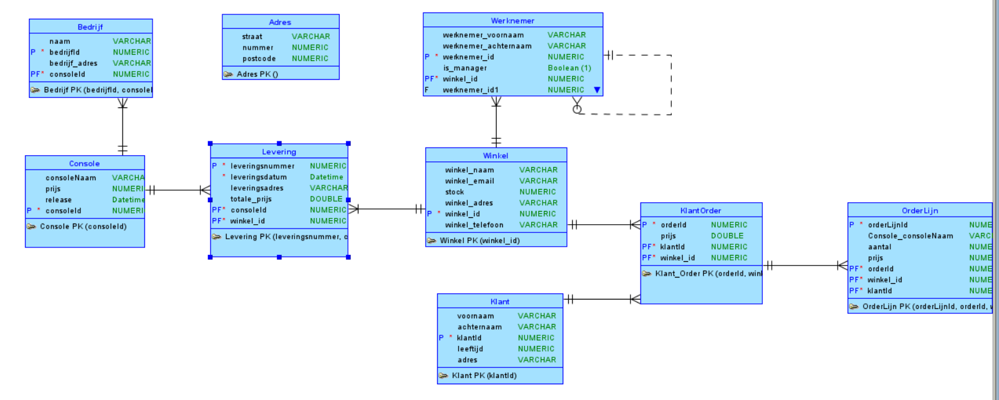
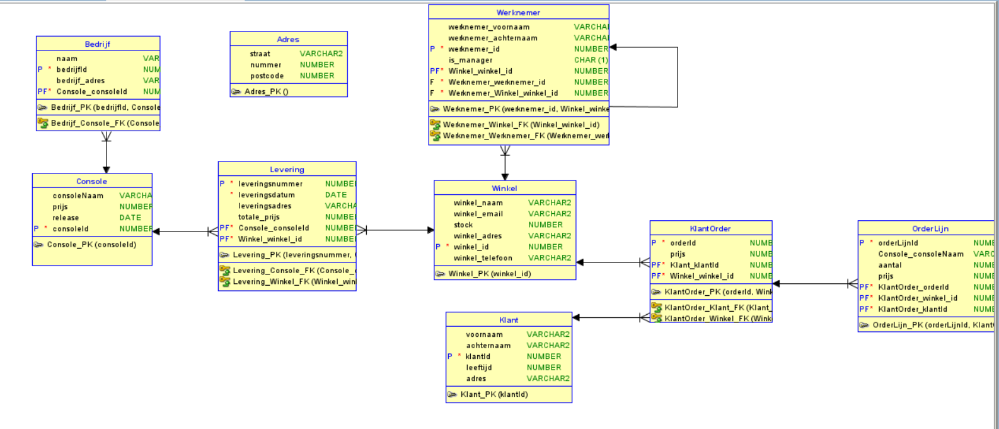

Milestone 2: Modellering
---
TOP DOWN MODELERING
---

Conceptueel Model
---

    Entiteittypes + Attributen + PK
---
- Bedrijf (**bedrijf_id**, bedrijf_naam, bedrijf_adres)
- Console (**console_id**, console_naam, prijs, release_datum)
- Levering (**console_id**, **winkel_id**, leveringsadres, leveringsdatum, totale_prijs)
- Winkel (**winkel_id**, winkel_naam, winkel_email, stock, winkel_telefoon, winkel_adres)
- Klant (**klant_id**, klant_voornaam, klant_achternaam, klant_leeftijd, klant_adres)
- Klant_Order (**order_id**, **klant_id**, order_prijs)
- Werknemer (**werknemer_id**, werknemer_voornaam, werknemer_achternaam, is_manager)
- Orderlijn (**Orderlijn_id**, **console_id**, aantal)
- Adres (straat, nummer, postcode) -> DATATYPE 

    Domeinen - constraints
--- 
- Console: prijs tussen 50.0 en 900.0
- Klant: leeftijd > 16
- winkel: email moet @ hebben 
- orderlijn: aantal < 4

    Tijd 
---
- Console: release_datum
- Levering: leveringsdatum (datum wnr levering bij winkel moet zijn)

    Conceptueel ERD
---

Logisch Model
---

    Intermediërende  entiteiten
---
- Levering: Console - Winkel
- KlantOrder: Winkel - Klant

    Logisch ERD
---

Verschillen na Normalisatie
---
Een extra klasse adres - sinds straatnaam, nummer en postcode vaak voorkomt.
In de conceptueel en logische ERD is dit als een datatype gemodelleerd.  
