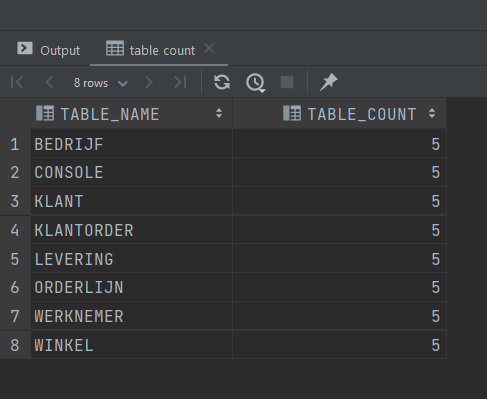
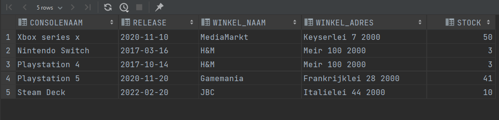
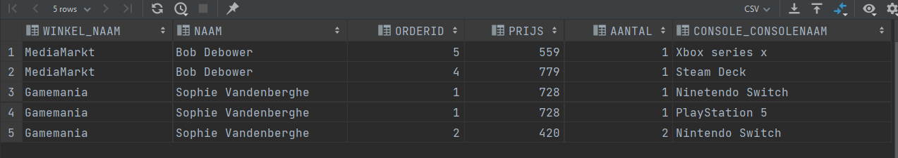
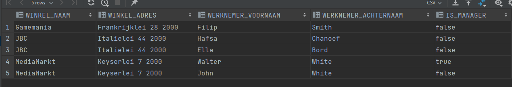
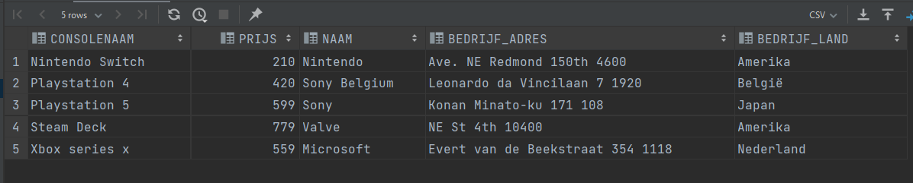
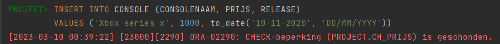
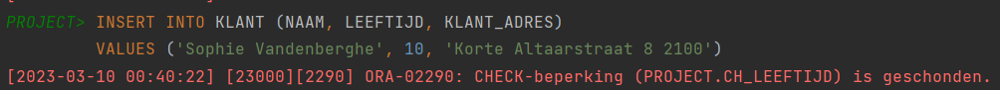
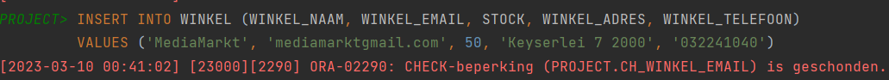
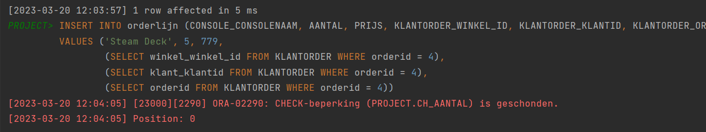

Milestone 3: Creatie Databank
---

    Identity columns
---
- Mandatory
    - console: console_id
    - winkel: winkel_id
    - klant: klant_id
    - klantorder: order_id
    - orderlijn: orderlijn_id
- other:
    - bedrijf: bedrijf_id
    - werknemer: werknemer_id
    - levering: leveringsnummer

      Table Counts
---

    @query 1: Relatie Veel-op-veel

    SELECT C.CONSOLENAAM, C.RELEASE, W.WINKEL_NAAM, W.Winkel_ADRES, W.STOCK
    FROM CONSOLE C
    JOIN LEVERING L on C.CONSOLEID = L.CONSOLE_CONSOLEID
    JOIN WINKEL W on L.WINKEL_WINKEL_ID = W.WINKEL_ID;
--- 

    @query 2: 2 niveau’s diep

    SELECT W.WINKEL_NAAM, K.NAAM , KO.ORDERID, KO.PRIJS, O.AANTAL, O.CONSOLE_CONSOLENAAM
    FROM WINKEL W
    JOIN KLANTORDER KO on W.WINKEL_ID = KO.WINKEL_WINKEL_ID
    JOIN KLANT K on K.KLANTID = KO.KLANT_KLANTID
    JOIN ORDERLIJN O on KO.ORDERID = O.KLANTORDER_ORDERID and KO.WINKEL_WINKEL_ID = O.KLANTORDER_WINKEL_ID and KO.KLANT_KLANTID = O.KLANTORDER_KLANTID
    ORDER BY K.NAAM;
--- 

    @query 3: Werknemers

    SELECT W.WINKEL_NAAM, W.WINKEL_ADRES, WN.WERKNEMER_VOORNAAM, WN.WERKNEMER_ACHTERNAAM, WN.IS_MANAGER
    FROM WINKEL W
    JOIN WERKNEMER WN on W.WINKEL_ID = WN.WINKEL_WINKEL_ID
    ORDER BY W.WINKEL_NAAM;
--- 

    @query 4: Bedrijven

    SELECT C.CONSOLENAAM, C.PRIJS, B.NAAM, B.BEDRIJF_ADRES, B.BEDRIJF_LAND
    FROM CONSOLE C
    JOIN BEDRIJF B on C.CONSOLEID = B.CONSOLE_CONSOLEID
    ORDER BY C.CONSOLENAAM;
--- 

Bewijs Domeinen - constraints M2
--- 
    Console: prijs tussen 50.0 en 900.0

---

    Klant: leeftijd > 16

---

    winkel: email moet @ hebben

---

    orderlijn: aantal < 4

---
